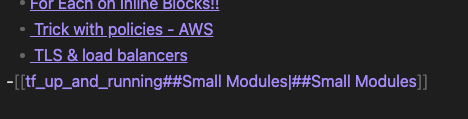
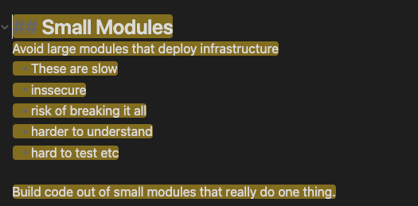

# obsidian_clickable_toc_generator
Creates a Table of Contents that is clickable for Obsidian

Supply a file with `-file` and the app will identify all headings and create a clickable Table of Contents.

Creates table of contents in the format of:
`[[Note_name#HEADING_NAME|#HEADING_NAME]]`

Example Table of Contents:

Example after click:
